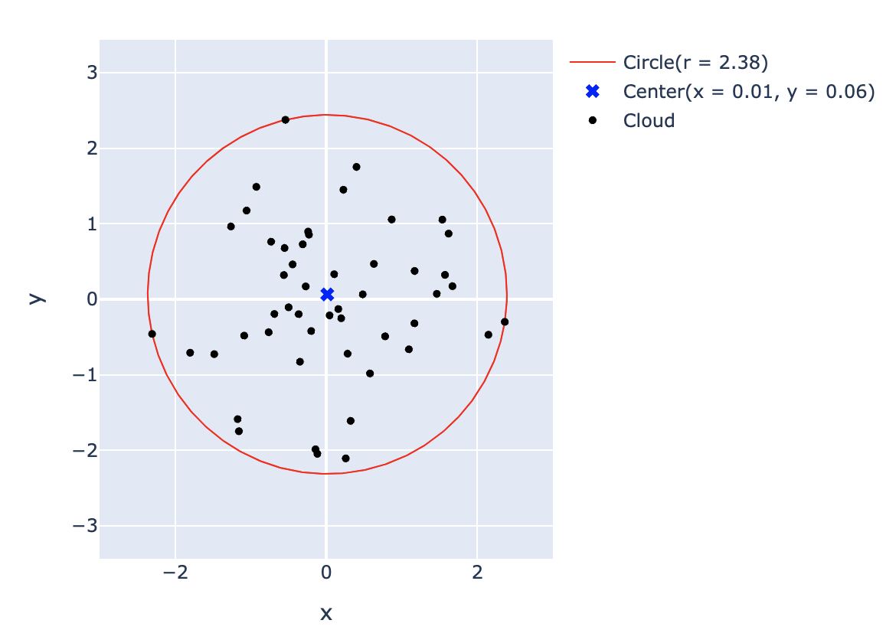

# [cvxball](https://www.cvxgrp.org/cvxball/book)

[](LICENSE)
[](https://github.com/cvxgrp/cvxball/actions/workflows/ci.yml)
[](https://coveralls.io/github/cvxgrp/cvxball?branch=main)
[](https://github.com/tschm/package)

We compute the smallest enclosing circle/ball for a set of points.



```python
>>> import numpy as np
>>> from cvx.ball.solver import min_circle_cvx

# create a numpy array where each row corresponds to a point
>>> points = np.array([[2.0, 4.0], [0, 0], [2.5, 2.0]])

# compute the circle, pick any solver supporting conic constraints
>>> radius, centre = min_circle_cvx(points, solver="CLARABEL")

```

## Background

We are solving the convex optimization problem:

$$
\min_r \quad r
$$

subject to the constraint that for each point $p_i$, the Euclidean
distance from $p_i$ to the center of the circle is less than or
equal to the radius $r$:

$$
\| p_i - \text{center} \| \leq r, \quad \forall i = 1, 2, \dots, n
$$

Where:

- $p_i$ are the points in $\mathbb{R}^d$.
- $\text{center}$ is the center of the circle we are trying to find.
- $r$ is the radius of the circle.

The goal is to minimize the radius $r$ such that all points
lie inside or on the boundary of the circle.

---

### Interpretation as a Min/Max Problem

The constraint $\| p_i - \text{center} \| \leq r$ implies that
the radius $r$ must be at least as large as the maximum distance
from the center to any of the points $p_i$.

If we define the distance from the center to each point as:

$$
d_i = \| p_i - \text{center} \|
$$

Then, the radius $r$ must satisfy:

$$
r \geq \max_i d_i
$$

Thus, the optimization problem becomes:

$$
r = \min \max_i d_i
$$

This is a **min-max** problem, where we want to
minimize the maximum distance from the center to any of the points.
In other words, we are looking for the smallest possible radius $r$
such that the maximum distance from the center to any point is minimized.

---

### Geometric Interpretation

Geometrically, the problem is about finding the **smallest enclosing circle**
(or ball in higher dimensions) that contains all the given points.
The center of the circle is positioned in such a way that the radius
is minimized, but all points still lie inside or on the boundary of the circle.

- **Convexity**: The objective function $r = \min \max_i d_i$ is
convex, as the maximum of a set of convex functions is convex.
Minimizing a convex function over a convex set is a convex optimization problem.

- **Center and Radius**: The solution involves determining
both the center and the radius of the circle.
The optimal center minimizes the maximum distance to any of the points,
and the optimal radius ensures all points are inside
or on the boundary of the circle.

## Push to cloud.google.com
